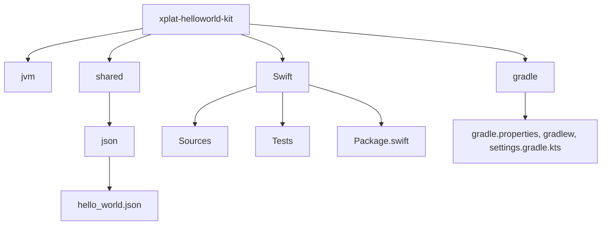

# 🌍 xplat-helloworld-kit

Welcome to **xplat-helloworld-kit**! 🚀 This repository provides a **template structure** for creating cross-platform libraries in **Swift** and **Kotlin** while sharing resources. It's perfect for monorepo setups! 🎉

---

## 🛠️ Why this structure?

This architecture is carefully designed for cross-platform development, offering key advantages:
- 📂 **Centralized shared schema**: Keep all shared data and schemas in a single location.
- 🕒 **Cross-platform time checks**: Ensure compatibility for shared resources under `/shared`.
- 🔄 **Synchronization-ready**: Support for tools like **Protobuf**, **OpenAPI**, and more for schema synchronization.

💡 Ideally, we'd have both `Package.swift` and `settings.gradle.kts` at the root for streamlined development. While this is tricky, tools like **Bazel** can help centralize package and executable definitions.

---

## 📁 Folder Structure

Here's how the project is organized:



---

## 🚀 Getting Started

1. **Clone the repo**:
   ```bash
   git clone https://github.com/baksha97/xplat-helloworld-kit.git
   ```

2. **Explore the structure**:
    - 📝 Shared JSON schema: `shared/json/hello_world.json`
    - ⚙️ Kotlin Project: `jvm/`
    - 🛠️ Swift Project: `Swift/`

3. **Customize for your project**:
    - Add your own **Protobuf** or **OpenAPI** schemas to `/shared`.
    - Sync the schemas across platforms with your favorite tools!

---

## 💡 Tips

- Consider using **Bazel** or a similar build system for centralizing dependencies and eliminating ambiguity in monorepo setups.
- Keep your shared resources minimal yet effective to maximize compatibility across platforms.

---

🎉 **Happy coding!** 🎉
